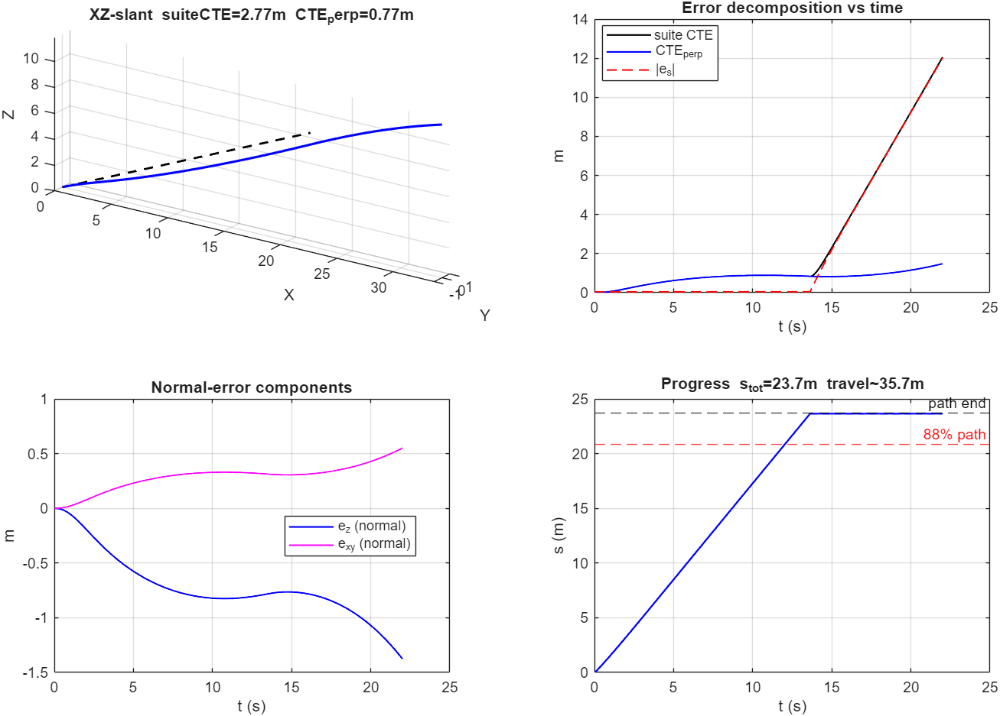
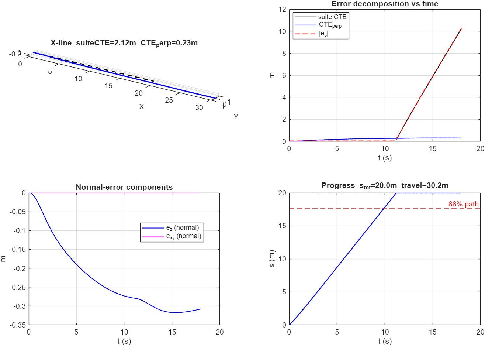

# VERTICAL_AUDIT_METRICS

**Date:** 2026-08-04 18:31:09
**Scope:** XZ slant + X-line only (no full suite). Metrics only — no new controller.

## Stack / T5B disposition

| Item | Value |
|------|------:|
| `lambda_muw_ff` | **0.25** (Tur3 freeze) |
| Tur4A `r_ff=U_h*κ` / T25 trim / timing | **kept** |
| `dt_controller` / `dt_guidance` / `tau_rate` | 0.0250 / 0.0750 / 0.0500 |
| `Ki_angle` / `Ki_rate` | 0.160 / 0.000 |
| Audit `K_gamma` | **0.00** (T5B OFF) |
| Audit `K_zdot` | **0.00** |
| T5B `K_gamma=0.75` | **experimental flag left in `init_parameters.m`** — NOT production acceptance (full suite never passed gates). Audit forces `K_gamma=0`.

## Suite CTE definition (current gate)

Suite / Tur runners compute

```text
CTE_suite(i) = min_j || p_vehicle(i) - path_waypoint(j) ||
```

This is **nearest discrete waypoint distance**, not Frenet normal CTE.
It mixes perpendicular path error with **along-track lag**, **startup**, and especially **endpoint overrun** (vehicle past last waypoint).

## Decomposition (this audit)

At progress point `p_d` with unit tangent `t_hat` (monotonic projection, guidance-like):

- `e_s = (p - p_d) · t_hat`  (along-track)
- `e_perp_vec = (I - t t^T)(p - p_d)`
- `CTE_perp = ||e_perp_vec||`
- `e_z`, `e_xy` = normal-error components
- Also: unconstrained geometric projection `CTE_geom_perp` (no progress hold)

Windows: **full**; **settled** `t≥5 s`; **before endpoint** `s < 0.88 s_total` and not `near_end`.

## XZ-slant

| Metric | Value |
|--------|------:|
| CTE_full (suite) | 2.767 m |
| CTE max (suite) | 12.051 m |
| CTE_settled t≥5s (suite) | 3.491 m |
| CTE_settled discard 20% (suite) | 3.396 m |
| CTE_before_endpoint (suite) | 0.598 m |
| mean \|e_s\| | 2.380 m |
| mean CTE_perp | 0.773 m |
| CTE_perp settled / before-end | 0.915 / 0.598 m |
| mean \|e_z\| (full / settled / pre-end) | 0.718 / 0.849 / 0.555 m |
| mean e_xy (normal) | 0.287 m |
| max startup suite CTE | 0.617 m |
| CTE_geom_perp mean (full / pre-end) | 0.773 / 0.597 m |
| path s_total / travel | 23.69 / 35.68 m |
| path overrun (travel − s_total) | ≈ 12.0 m |
| mean \|pitch err\| | 1.55 deg |



## X-line

| Metric | Value |
|--------|------:|
| CTE_full (suite) | 2.116 m |
| CTE max (suite) | 10.239 m |
| CTE_settled t≥5s (suite) | 2.886 m |
| CTE_settled discard 20% (suite) | 2.627 m |
| CTE_before_endpoint (suite) | 0.169 m |
| mean \|e_s\| | 2.047 m |
| mean CTE_perp | 0.228 m |
| CTE_perp settled / before-end | 0.278 / 0.168 m |
| mean \|e_z\| (full / settled / pre-end) | 0.228 / 0.278 / 0.168 m |
| mean e_xy (normal) | 0.000 m |
| max startup suite CTE | 0.189 m |
| CTE_geom_perp mean (full / pre-end) | 0.228 / 0.167 m |
| path s_total / travel | 20.00 / 30.20 m |
| path overrun (travel − s_total) | ≈ 10.2 m |
| mean \|pitch err\| | 0.15 deg |



## Answers

### 1) Of reported ~2.6 m XZ CTE, how much is real perpendicular path error?

| Window | suite CTE | CTE_perp | CTE_geom_perp | mean \|e_s\| | mean \|e_z\| |
|--------|----------:|---------:|--------------:|------------:|------------:|
| full | 2.767 | 0.773 (28% of suite) | 0.773 | 2.380 | 0.718 |
| settled t≥5s | 3.491 | 0.915 (26%) | 0.915 | 3.061 | 0.849 |
| before endpoint | 0.598 | 0.598 (100%) | 0.597 | 0.050 | 0.555 |

- Path length `s_total=23.69 m`, sim travel ≈ `35.68 m`, `T_final=22.0 s` → vehicle **overruns** by ~12 m of path length.
- Full-window mean `|e_s|=2.38 m` vs mean `CTE_perp=0.77 m` — along-track dominates the suite average.
- Before-endpoint window collapses suite CTE to **0.598 m**, identical to `CTE_perp` (100% perpendicular once endpoint samples are removed).
- Max startup suite CTE (t<5s): **0.617 m** (not the driver of the 2.6 m mean).
- **Verdict:** of reported ~2.6–2.8 m XZ suite CTE, only ~**28%** is true normal path error on the full window (`CTE_perp≈0.77 m`). The rest is **along-track / endpoint overrun** inflation of nearest-waypoint distance. Real depth-track error before endpoint: `|e_z|≈0.56 m`, `CTE_perp≈0.60 m`.

### 2) X-line: why ~2 m mean / ~10 m max while path looks flat?

| Metric | Value |
|--------|------:|
| Path length | 20.00 m (ends at x=20.0) |
| Sim travel / T_final | 30.20 m / 18.0 s |
| Vehicle end XYZ | [30.23, 0.00, -0.31] |
| suite CTE mean / max | 2.116 / 10.239 m |
| CTE_perp mean (full / pre-end) | 0.228 / 0.168 m |
| mean \|e_z\| / e_xy (full) | 0.228 / 0.000 m |
| vehicle end vs path end | x=30.23 vs x=20.0 (≈10 m overrun) |
| max startup suite CTE | 0.189 m |

**Cause:** X-line path is only **20 m** long but the sim runs **18 s** (~30 m travel). After the last waypoint, suite CTE = distance to the **endpoint**, so along-track overrun appears as large “cross-track” (max **10.24 m** ≈ overrun distance). Before-endpoint suite CTE drops to **0.17 m**, matching `CTE_perp`. The path looks flat because it is — `|e_z|≈0.17 m` on-path; the ~2 m / ~10 m suite numbers are a **metric artifact**.

### 3) Is the ≥15% XZ CTE gate still meaningful?

**Mostly no as currently defined.** The ≥15% gate targets suite nearest-waypoint CTE (Tur4A baseline 2.766 → ≤2.351). That number is dominated by **endpoint overrun + along-track**, so gain tweaks that improve true depth tracking barely move the gate (T5A/T5B saw only ~5%). **Retarget recommendation:**

1. Primary: **settled `CTE_perp`** and/or **mean `|e_z|`** on `t≥5 s` **and** `s < 0.88 s_total`.
2. Keep suite CTE only as a sanity check, or recompute it with the same before-endpoint mask.
3. Suggested starting targets (from this audit, before-endpoint): `CTE_perp` ≈ 0.598 m, `|e_z|` ≈ 0.555 m — set a relative improvement vs this frozen baseline, not vs inflated 2.6 m.

## Saturation / limit hits (same run, no controller change)

| Scenario | pitch_ref rate-lim % | angle-I near-limit % | muw_ff clamp % |
|----------|---------------------:|----------------------:|---------------:|
| X-line | 0.0 | 0.0 | 0.0 |
| XZ-slant | 0.0 | 0.0 | 0.0 |

## NEXT (do NOT implement in this task)

1. Elevator perturbation ID (authority / sign / delay).
2. A/B controller trials / coupled LQI `[ez, ezdot, eθ, q, Iz]`.
3. Yaw ref smoothness; R=5 speed scheduler (still deferred).
4. Retarget path-suite gates to settled `CTE_perp` / `|e_z|` (+ optional longer paths or stop-at-end).

## Files

- `run_vertical_audit.m` — this audit runner
- `suite_results/VERTICAL_AUDIT_METRICS.md` — this report
- `suite_results/audit_x_line.png`, `audit_xz_line.png` — optional plots
- `init_parameters.m` — `K_gamma=0.75` left as **experimental** default comment/flag (audit overrides to 0)
